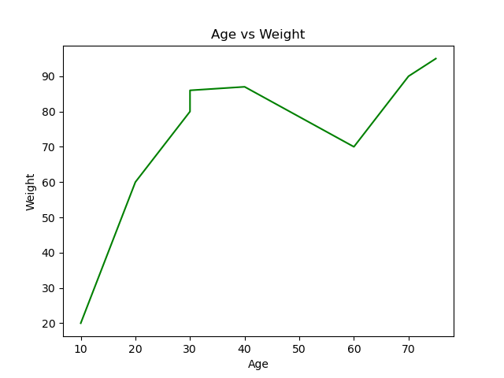

# 🧠 Data Science Learning Journey  

> Bu repo, veri bilimi temellerini öğrenirken oluşturduğum Jupyter Notebook çalışmalarını içerir. NumPy, Pandas, veri temizleme, görselleştirme ve veri analizi üzerine uygulamalı örnekler barındırır.

---

## 🚀 İçerik Başlıkları  
| Klasör / Dosya | Konu |  
|----------------|------|  
| `1-IntroToNumpy.ipynb` | NumPy’ye giriş, diziler ve temel işlemler |  
| `4-Pandas.ipynb` | Veri çerçeveleriyle çalışma, sütun işlemleri |  
| `9-VisualizationSeaborn.ipynb` | Seaborn ile veri görselleştirme |  
| `12-MissingDatas.ipynb` | Eksik veri analizi ve doldurma teknikleri |  
| `15-GooglePlayDatasetEDA.ipynb` | Google Play Store veri setiyle EDA örneği |  

---

## 🧰 Kullanılan Teknolojiler  
- **Python 3.x**  
- **Jupyter Notebook**  
- **NumPy**  
- **Pandas**  
- **Matplotlib / Seaborn**  
- (İleri seviye aşamada) **Scikit-Learn**  

---

## ⚙️ Nasıl Çalıştırılır  
```bash
# Reponun klonlanması
git clone https://github.com/AbdullahTurgut/data-science.git
cd data-science

# Gerekli kütüphanelerin kurulumu
pip install -r requirements.txt

# Notebook'ları başlatmak için
jupyter notebook
```

---

## 🧩 Amaç  
Bu projedeki hedefim:  
- Veri bilimi temellerini sistematik biçimde öğrenmek,  
- Gerçek veri setleri üzerinde analiz pratiği yapmak,  
- Görselleştirme becerilerini geliştirmek,  
- Veri ön işleme (data preprocessing) sürecini pekiştirmek.  

---

## 📊 Örnek Görsel  
  

---

## 🤝 Katkıda Bulunma  
İsteyen herkes bu repoya katkı sağlayabilir:  
1. Fork et  
2. Yeni bir branch oluştur (`feature/ekleme`)  
3. Değişikliklerini yap  
4. Pull Request gönder  

---

## 🧑‍💻 Geliştirici  
**Abdullah Turgut**  
📍 GitHub: [AbdullahTurgut](https://github.com/AbdullahTurgut)  

---

✨ Veri bilimi yolculuğumun ilk adımları!  
